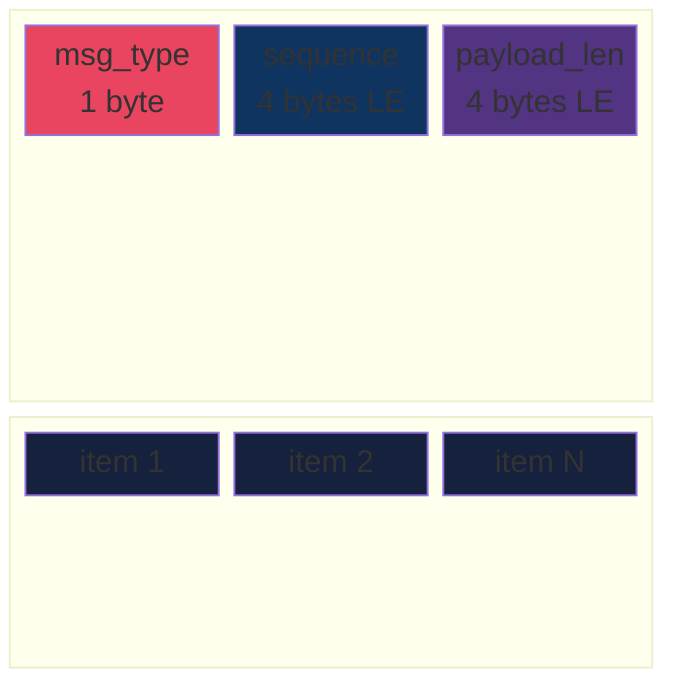

# tauri-wire

[](LICENSE-MIT)
[](https://www.rust-lang.org)

Binary streaming wire protocol for Tauri IPC. Zero-parse on the JS side.

---

## Why

Tauri serializes all IPC payloads as JSON. For most UI operations this is fine. For high-frequency numeric streams (live ticks, sensor data, order books, audio buffers, telemetry) it becomes the bottleneck.

| | JSON (`serde_json`) | Binary (`tauri-wire`) | Improvement |
|---|---:|---:|---:|
| **Encode 100 items** | 10,119 ns | 358 ns | **28x faster** |
| **Decode 100 items** | 14,490 ns | 433 ns | **33x faster** |
| **Wire size (100 items)** | 5,744 B | 3,209 B | **44% smaller** |
| **1,000 items push + drain** | — | 15,887 ns | **< 16 &micro;s total** |

<sub>Rust-side encode/decode only. 32-byte structs (i64 + 2&times;f64 + 2&times;u32), AMD Ryzen / Linux 6.8, `cargo bench`. Full source in [`benches/throughput.rs`](crates/tauri-wire/benches/throughput.rs). JS-side decode via `DataView` is not benchmarked here but avoids `JSON.parse()` entirely.</sub>

`requestAnimationFrame` syncs to the display's refresh rate. On **Windows** (WebView2) and **Android**, this means 144 Hz, 240 Hz, etc. &mdash; your frame budget shrinks to 6.9 ms or 4.2 ms respectively. On **macOS/iOS** (WKWebView), `requestAnimationFrame` is currently **capped at 60 fps** regardless of ProMotion display capabilities ([tauri#13978](https://github.com/tauri-apps/tauri/issues/13978), [WebKit#173434](https://bugs.webkit.org/show_bug.cgi?id=173434)). On **Linux** (WebKitGTK), it typically runs at 60 fps.

Even at 60 Hz (16.6 ms budget), `JSON.parse()` on a 5 KB payload takes 0.5-2 ms. At 144 Hz that's 7-29% of your frame budget gone on parsing alone. `DataView` reads on the same data are near-instant &mdash; no parsing, just typed reads at known offsets.

### The gap this fills

Tauri v2 provides the raw binary pipes &mdash; [`ipc::Response`](https://docs.rs/tauri/latest/tauri/ipc/struct.Response.html) for returning `Vec<u8>`, and [`Channel`](https://docs.rs/tauri/latest/tauri/ipc/struct.Channel.html) for push-based streaming. What it does **not** provide is a codec layer on top: framing, sequencing, batching, and a matching JS decoder. That is what `tauri-wire` is.

This is a known gap. Relevant upstream discussions:

- [tauri#7706 &mdash; Deprecate JSON in IPC](https://github.com/tauri-apps/tauri/issues/7706)
- [tauri#13405 &mdash; ArrayBuffer support in events](https://github.com/tauri-apps/tauri/issues/13405)
- [tauri#7146 &mdash; High-rate data from Rust to frontend](https://github.com/tauri-apps/tauri/discussions/7146)
- [tauri#5511 &mdash; Faster Rust-to-webview data transfer](https://github.com/tauri-apps/tauri/discussions/5511)

## Design principles

- **Streaming-first.** Every frame is self-contained. Send one at a time through a `Channel`, accumulate many in a `StreamBuffer`, or pipe over a WebSocket. Same decoder either way.
- **Generic.** You define your message types by implementing `WireMessage`. The protocol does not know what is inside the payload.
- **Zero dependencies.** The core crate uses only `std`. No serde, no allocator tricks. Optional `derive` feature adds a proc-macro for zero-boilerplate message types.
- **Transport-agnostic.** Designed for Tauri IPC but works over any byte transport.

## How it works

```mermaid
flowchart LR
    subgraph Rust["Rust (any thread)"]
        direction TB
        A["Your data struct"] -->|"WireMessage::encode()"| B["Binary payload\n(LE bytes)"]
        B --> C["Frame\n9B header + payload"]
    end

    subgraph Buffer["StreamBuffer"]
        direction TB
        C -->|"push() / push_one()"| D["Accumulated\nframes"]
        D -->|"drain()"| E["Vec &lt;u8&gt;"]
    end

    subgraph Transport["Transport"]
        E -->|"ipc::Response\nChannel\nWebSocket"| F["Raw bytes"]
    end

    subgraph JS["TypeScript (webview)"]
        direction TB
        F --> G["FrameIterator"]
        G -->|"for...of"| H["Frame"]
        H -->|"readF64() readI64()\nreadU32() ..."| I["Your UI\n@ 60 fps"]
    end

    style Rust fill:#1a1a2e,stroke:#e94560,color:#eee
    style Buffer fill:#16213e,stroke:#0f3460,color:#eee
    style Transport fill:#0f3460,stroke:#533483,color:#eee
    style JS fill:#1a1a2e,stroke:#e94560,color:#eee
```





## Wire format

```
Frame (self-contained, 9-byte header):
  [u8  msg_type]       user-defined tag (0-255)
  [u32 sequence]       monotonic per type; gaps = dropped frames
  [u32 payload_len]    byte count after this header
  [payload ...]        payload_len bytes of encoded items

All integers are little-endian.
Frames are concatenated in a buffer. Unknown msg_type values are safely skipped.
```

## Install

Add to your `Cargo.toml`:

```toml
[dependencies]
tauri-wire = "0.1"

# Optional: derive macro for zero-boilerplate message types
tauri-wire = { version = "0.1", features = ["derive"] }
```

Minimum supported Rust version: **1.85**.

## Usage

### 1. Define wire types

**With derive** (recommended):

```rust
use tauri_wire::WireMessage;

#[derive(WireMessage)]
#[wire(msg_type = 1)]
struct Tick {
    ts_ms: i64,
    price: f64,
    size: f64,
    side: u8,
}
```

The derive macro generates `encode`, `decode`, and `encoded_size` for all primitive numeric fields (`u8`-`u64`, `i8`-`i64`, `f32`, `f64`, `bool`). All encoding is little-endian.

**Manual implementation** (for variable-size types or custom layouts):

```rust
use tauri_wire::WireMessage;

struct Tick {
    ts_ms: i64,
    price: f64,
    size: f64,
    side: u8,
}

impl WireMessage for Tick {
    const MSG_TYPE: u8 = 1;

    fn encode(&self, buf: &mut Vec<u8>) {
        buf.extend_from_slice(&self.ts_ms.to_le_bytes());
        buf.extend_from_slice(&self.price.to_le_bytes());
        buf.extend_from_slice(&self.size.to_le_bytes());
        buf.push(self.side);
        buf.extend_from_slice(&[0u8; 7]); // pad to 32 bytes
    }

    fn encoded_size(&self) -> usize { 32 }

    fn decode(data: &[u8]) -> Option<(Self, usize)> {
        if data.len() < 32 { return None; }
        Some((Self {
            ts_ms: i64::from_le_bytes(data[0..8].try_into().ok()?),
            price: f64::from_le_bytes(data[8..16].try_into().ok()?),
            size:  f64::from_le_bytes(data[16..24].try_into().ok()?),
            side:  data[24],
        }, 32))
    }
}
```

### 2. Stream from Rust

**Poll model** &mdash; accumulate frames, drain per render tick:

```rust
use tauri_wire::StreamBuffer;

let stream = StreamBuffer::new();

// Any thread can push
stream.push(&[tick1, tick2, tick3]);

// Consumer drains once per frame
let bytes: Vec<u8> = stream.drain(); // concatenated frames
```

**Push model** &mdash; send individual frames immediately:

```rust
use tauri_wire::encode_frame;

let frame: Vec<u8> = encode_frame(&[tick1, tick2]);
// Send frame through tauri::ipc::Channel, WebSocket, etc.
```

### 3. Integrate with Tauri v2

```rust
use tauri::State;
use tauri_wire::StreamBuffer;

#[tauri::command]
fn poll(stream: State<StreamBuffer>) -> tauri::ipc::Response {
    tauri::ipc::Response::new(stream.drain())
}
```

### 4. Decode in TypeScript

Install the npm package or copy the single file:

```sh
npm install @tauri-wire/decoder
# or just copy crates/tauri-wire/ts/decoder.ts into your project
```

```typescript
import { invoke } from '@tauri-apps/api/core';
import { FrameIterator } from './decoder';

async function onFrame() {
  const buf: ArrayBuffer = await invoke('poll');

  for (const frame of new FrameIterator(buf)) {
    switch (frame.msgType) {
      case 1: // Tick
        frame.forEachItem(32, (off) => {
          const ts    = frame.readI64(off);
          const price = frame.readF64(off + 8);
          const size  = frame.readF64(off + 16);
          const side  = frame.readU8(off + 24);
          chart.addTick(ts, price, size, side);
        });
        break;
    }
  }

  requestAnimationFrame(onFrame);
}
```

## When to use this vs JSON

| Data path | Recommended format | Why |
|---|---|---|
| **Hot** (&gt;10 msg/s, numeric, fixed-layout) | `tauri-wire` | 28-33x faster encode/decode, 44% smaller wire |
| **Warm** (structured, strings, moderate frequency) | [`sonic-rs`](https://github.com/cloudwego/sonic-rs) | Drop-in serde_json replacement, 2-5x faster via SIMD |
| **Cold** (config, settings, user-edited) | `serde_json` / TOML | Human-readable, schema-flexible |

Do **not** use `tauri-wire` for:
- Data with strings or nested variable-length objects (JSON is more ergonomic)
- Payloads under 1 KB at low frequency (JSON overhead is negligible)
- Anything that needs to be human-inspectable in transit

## API overview

| Type | Role |
|---|---|
| [`WireMessage`](crates/tauri-wire/src/protocol.rs) | Trait. Implement for your data types (or derive it). |
| [`FrameHeader`](crates/tauri-wire/src/protocol.rs) | 9-byte frame header: msg_type + sequence + payload_len. |
| [`encode_frame`](crates/tauri-wire/src/protocol.rs) | Encode a slice of messages into a standalone frame (`Vec<u8>`). |
| [`encode_frame_with_seq`](crates/tauri-wire/src/protocol.rs) | Like `encode_frame` but with a custom sequence number. |
| [`StreamBuffer`](crates/tauri-wire/src/stream.rs) | Thread-safe accumulator. Push from any thread, drain per frame. |
| [`BufferFull`](crates/tauri-wire/src/stream.rs) | Error type for bounded `StreamBuffer` backpressure. |
| [`FrameReader`](crates/tauri-wire/src/decode.rs) | Zero-copy iterator over frames in a byte buffer. Implements `Iterator`. |
| [`FrameView`](crates/tauri-wire/src/decode.rs) | Borrowed view of one frame. Decode items or read raw payload. |
| [`WireMessage` derive](crates/tauri-wire-derive/) | Proc-macro for deriving `WireMessage` on structs (feature `derive`). |

TypeScript side:

| Type | Role |
|---|---|
| [`FrameIterator`](crates/tauri-wire/ts/decoder.ts) | `IterableIterator<Frame>` over frames in an `ArrayBuffer`. |
| [`Frame`](crates/tauri-wire/ts/decoder.ts) | Typed read helpers (`readF64`, `readI64`, `readI8`, `readBool`, ...) at payload offsets. |

## Examples

| Example | Description |
|---|---|
| [`market_data`](crates/tauri-wire/examples/market_data.rs) | Ticks, OHLCV bars, variable-length order book snapshots |
| [`sensor_stream`](crates/tauri-wire/examples/sensor_stream.rs) | IoT sensor readings with mixed field types |

```sh
cargo run -p tauri-wire --example market_data
cargo run -p tauri-wire --example sensor_stream
```

## Benchmarks

```sh
cargo bench
```

Results on AMD Ryzen 7 / Linux 6.8 / Rust 1.85:

```
encode_100/binary       time:   [355 ns  358 ns  360 ns]
encode_100/json         time:   [10.0 µs 10.1 µs 10.3 µs]

decode_100/binary       time:   [431 ns  433 ns  435 ns]
decode_100/json         time:   [14.4 µs 14.5 µs 14.6 µs]

stream_push_drain_1000  time:   [15.8 µs 15.9 µs 16.0 µs]

wire_size/binary_3209B  (100 items, 32 bytes each)
wire_size/json_5744B    (100 items, same data)
```

## Platform support

The Rust crate is platform-agnostic (uses only `std`, no external dependencies). The TypeScript decoder requires `DataView` (available in all modern browsers and WebView2/WebKitGTK).

| Platform | Supported |
|---|:---:|
| Linux | &check; |
| Windows | &check; |
| macOS | &check; |
| Android (Tauri v2) | &check; |
| iOS (Tauri v2) | &check; |
| WASM (non-Tauri) | &check; |

## Wire format stability

The wire format (9-byte header, LE integers) is **unstable** until version 1.0. Breaking changes to the frame layout will be accompanied by a minor version bump and documented in the changelog.

## Project structure

```
tauri-wire/
  crates/
    tauri-wire/             Core library
      src/
        lib.rs              Public API and crate docs
        protocol.rs         WireMessage trait, FrameHeader, encode_frame
        stream.rs           StreamBuffer (thread-safe accumulator)
        decode.rs           FrameReader, FrameView (zero-copy decoder)
      ts/
        decoder.ts          TypeScript decoder (single file, zero deps)
        package.json        npm package config (@tauri-wire/decoder)
      examples/
        market_data.rs      Financial data streaming example
        sensor_stream.rs    IoT sensor streaming example
      benches/
        throughput.rs       JSON vs binary benchmarks
    tauri-wire-derive/      Derive macro for WireMessage
      src/lib.rs            Proc-macro implementation
```

## Contributing

Contributions are welcome. Please open an issue before submitting large changes.

## License

Licensed under either of

- [MIT License](LICENSE-MIT)
- [Apache License, Version 2.0](LICENSE-APACHE)

at your option.
